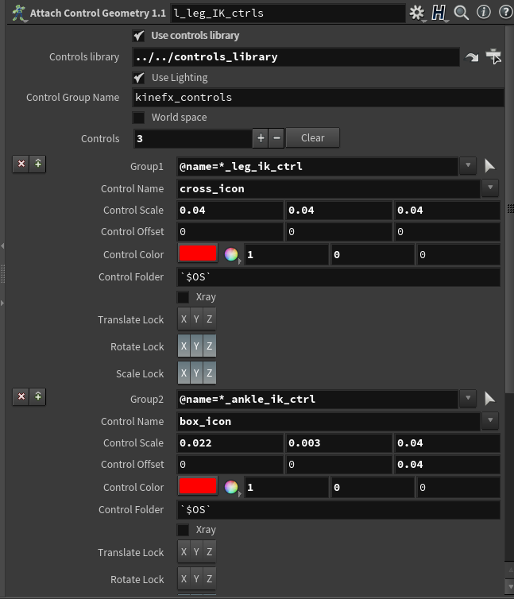
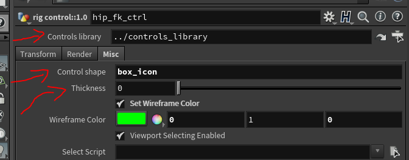
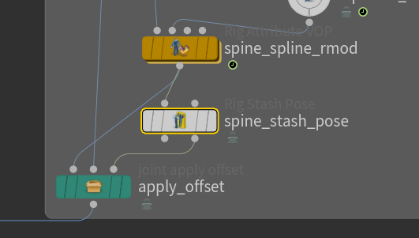
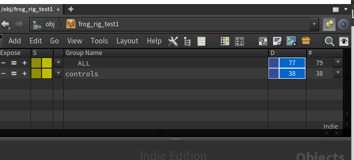

# kinefx tools
Collection of rigging tools and utils for Houdini kinefx.


## Installation
### Python scripts
Copy: **create_obj_ctrls.py** to source python directory.
[Houdini DOCs - Python scripts location](https://www.sidefx.com/docs/houdini/hom/locations.html)
or add it to your *sys.path*

### Digital assets
Be sure that all digital assets are installed and ready to use before using scripts.

## HDAs
There are a few handy HDAs, some of them are required to be installed in order to use them with scripts. 

### Controls library (controls_library::1.0) (OBJ)
Generates different shapes of controls as geometry which can be used in conjunction with **Attach Control Geometry SOP**

required by: **create_obj_ctrls.py**

---

### Attach Control Geometry (kinefx::attach_geometry_control::1.1) (SOP)
Modified attach control geometry sop. Added extra functionality to make the process of creating controls more "encapsulated". You can assign individual colors for controls, manipulate the scale of controls and their offsets directly from this one node.  


Instead of connecting a "library" of controls as input, you just can now use the node path:


You can specify which channels will be locked after creating controls by setting **Translate/Rotate/Scale Lock** parameter

**Control Folder** Let's you specify the name of folder into which controls will be promoted on your rig HDA.

This node creates extra attributes that are quired during the creation of *object level* controls. Check step by step tutorial. Setting **Xray** parameter **ON** will make *object level* controls automatically set to Xray.

required by: **create_obj_ctrls.py**

---

### rig control 1.0 (rig_control::1.0) (OBJ)
Node used directly as rig control. Allow for dynamic change of control shape, which is loaded from the controls library. *Thickness* parameter adds easy control of how thick control should be displayed. 


This node will be should be used in conjunction with *rig_zero* node as its parent (zero group). 

required by: **create_obj_ctrls.py**

---

### rig zero 1.0 (rig_zero::1.0) (OBJ)
This acts as a zero group for controls. But also moves them to keep them in sync with the joint's position. That node reads detail attributes generated by *create_zero_attr::1.0*


All of that is created and connected automatically when using the create_obj_ctrls.py script.

required by: **create_obj_ctrls.py**

---

### create zero attrs 1.0 (create_zero_attr::1.0) (SOP)
Breaks down *localtransform* matrix per channel and saves it as detail attribute for every joint. That information later is used by *rig_zero* node to move it.

required by: **create_obj_ctrls.py**

---

### joint apply offset (joint_apply_offset::1.0) (SOP)
Applies offset to joints. Useful for example when you do spline IK, after solving IK you would like to keep joints offset in such a way that they will match the original skeleton in the default pose. 

To see it in action open: start.hiplc


----

## Usage

### Create object level control
```python
# You can add this code as button on shelf 
from kinefx_extra import create_obj_ctrls
create_obj_ctrls.run()
```

### Promote selected controls:
After the creating controls with above script. Now at object level you will have a group called controls. 


That will let you easily select all controls for your rig. Then just run script:
```python
# You can add this code as button on shelf 
import kinefx_tools
kinefx_tools.create_obj_ctrls.promote_selected_controls()
```

### Create object level controls - Video:
[](https://www.youtube.com/watch?v=uQ1cNjDZ-fs)

### Easy way of locking channels- Video:
[](https://www.youtube.com/watch?v=iCS5VFZQDQU)

### Create object level controls - Video:
[](https://www.youtube.com/watch?v=8Ev4VLDgE5I)


## Tips

### Bypass Attach Controls Geometry node
After creating your object level controls, you can bypass all Attach Controls Geometry nodes. That will speedup rig significantly due to the slow Python SOP inside. They aren't needed anymore, but keep them in case you would like to change something later. The bypass is enough. You can create group: or bundle if you prefer to be able to easily switch them ON and OFF. 

### Use blast instead of delete joints SOP
Delete joints sop does an extra reparenting steps via python code. Use blast wherever you can. 


## Contributing and support
Pull requests are welcome. For major changes, please open an issue first to discuss what you would like to change.

## License
[Apache-2.0](https://choosealicense.com/licenses/apache-2.0/)
